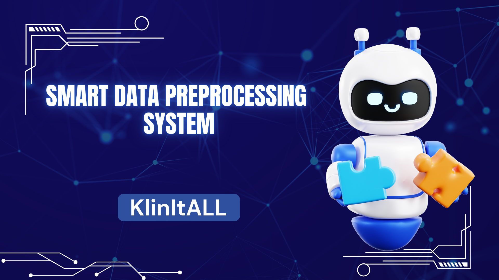

# 🧹 KlinItAll
---
## Overview
KlinItAll is a modular, production-ready, and extensible data preprocessing system designed to **clean, prepare, and analyze structured datasets** including numeric, categorical, text, date-time, and geospatial data for machine learning and analytics.  

Built with Streamlit, KlinItAll integrates **AI-powered narratives**, interactive visualizations, and a **context-aware chatbot** to provide real-time insights, recommendations, and guidance during the preprocessing workflow.

---

## Purpose of the System
KlinItAll addresses the common challenge in data science: **50–80% of project time is consumed by data cleaning, formatting, and preprocessing**. This system automates repetitive tasks while providing intelligent guidance, enabling analysts to focus on **insight generation, modeling, and decision-making**.

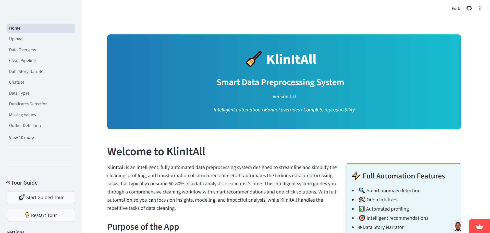

---

## Key Features

### 1. Interactive AI-Powered Data Story Narrator
- Generates AI-driven narratives for datasets.  
- Highlights trends, anomalies, correlations, and data quality issues.  
- Interactive exploration: click columns/metrics for details.  
- Visual analytics: histograms, scatter plots, heatmaps, time-series trends.  
- Scenario simulation: “what-if” analyses.  
- Export AI narratives, charts, and recommendations to Markdown/PDF.

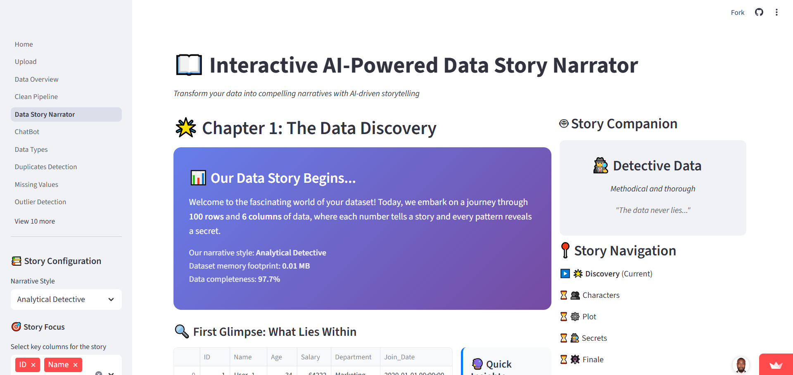  

---
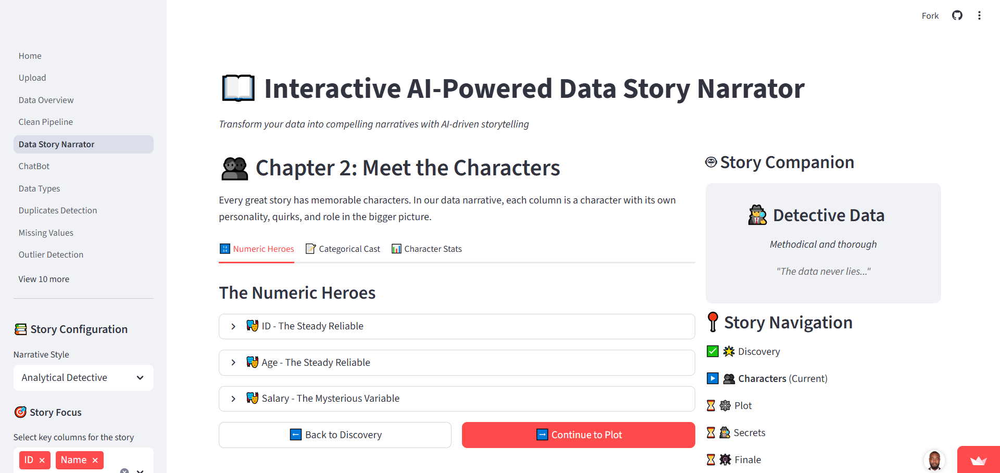 

---
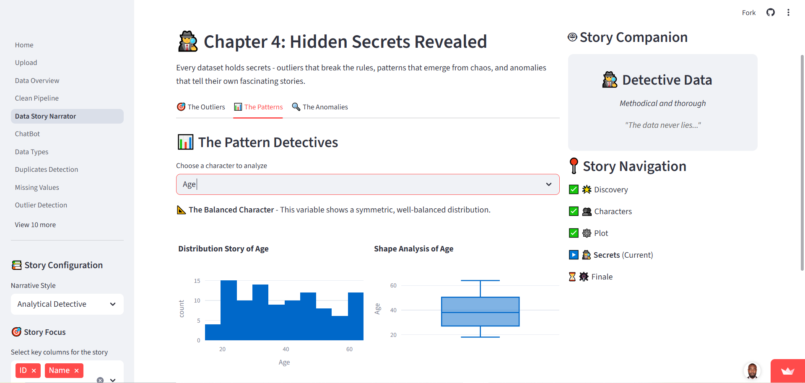  

---
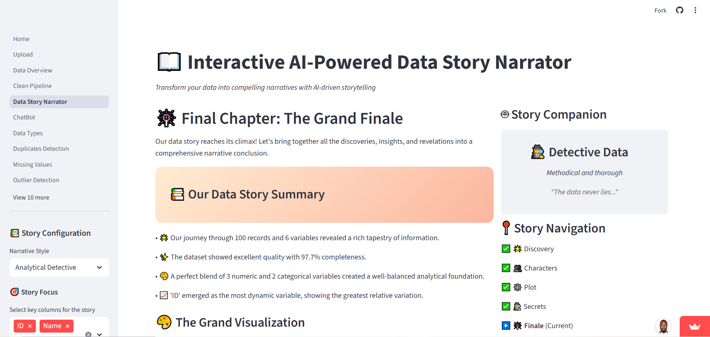

### 2. Comprehensive Pipeline Summary Dashboard
- Tracks preprocessing activities in real-time.  
- Displays statistics, progress, and AI summaries.  

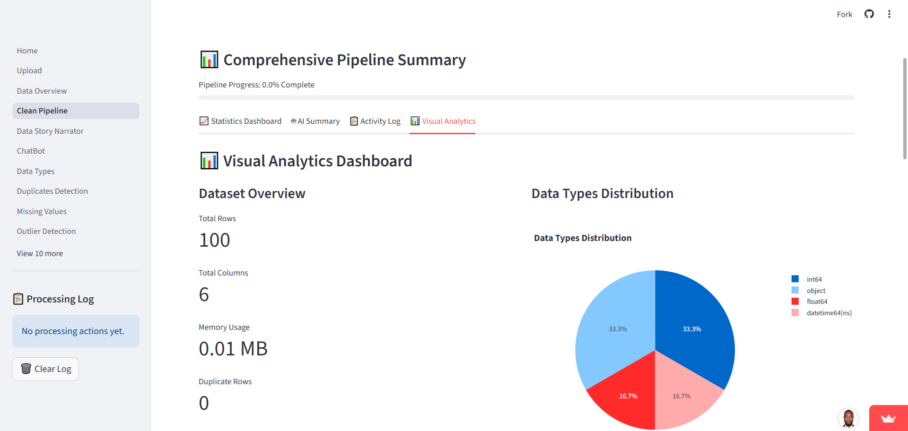  

---
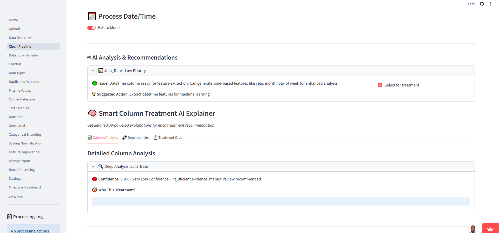  

---

  

### 3. Milestones & Achievements
- Dynamic achievement system for process completion, dataset downloads, page completions, advanced preprocessing.  
- Visual indicators of active milestones in the UI.

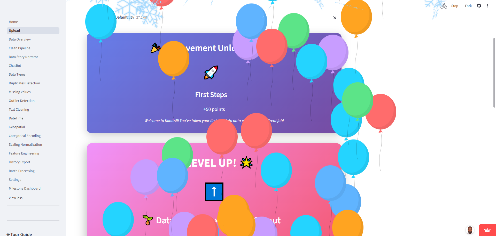

---

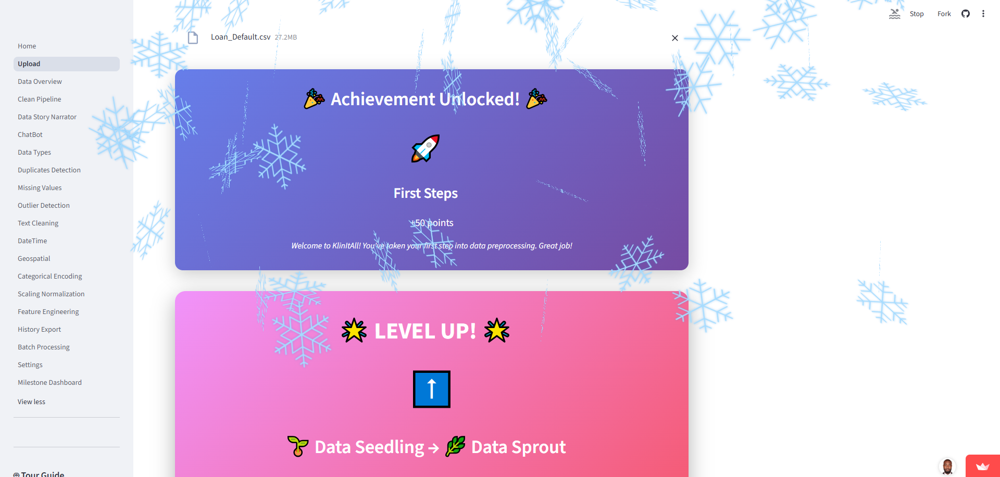

---

### 4. Chatbot Integration
- Fully data-aware: answers free-text queries about the dataset and preprocessing steps.  
- Provides navigation support, explanations, and triggers actions.

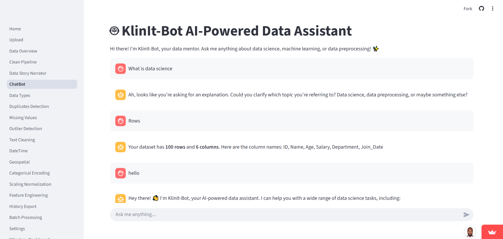

### 5. Individual Page Functionalities
- Data Overview & Profiling  
- Missing Values Treatment  
- Outlier Detection & Treatment  
- Scaling & Normalization  
- Categorical Encoding  
- Text Cleaning / NLP  
- Date-Time / Geospatial Processing  
- Feature Engineering & Dimensionality Reduction  
- Duplicate Detection & Fuzzy Matching  
- Data Type Conversion & Validation  
- Transformation History & Export  
- Batch Mode
- Settings & About 

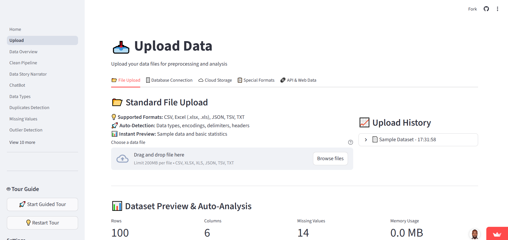  

---
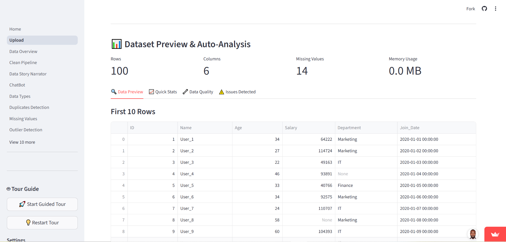  

---
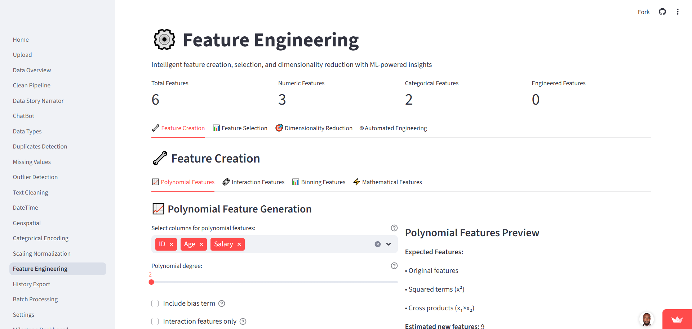  

---
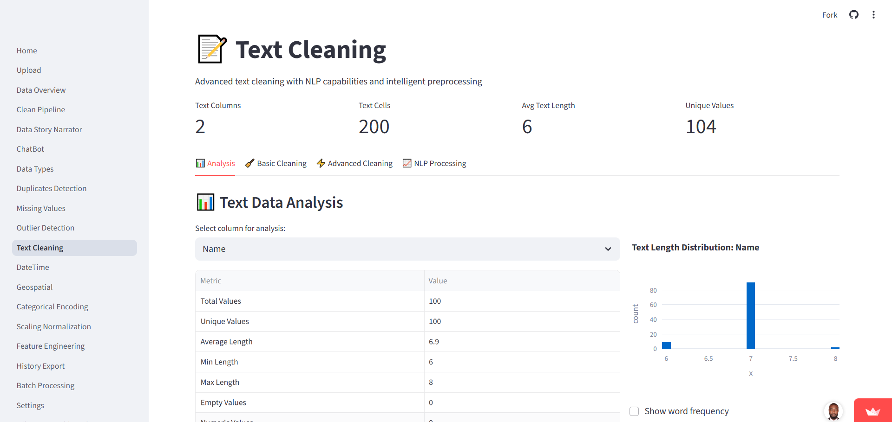  

---
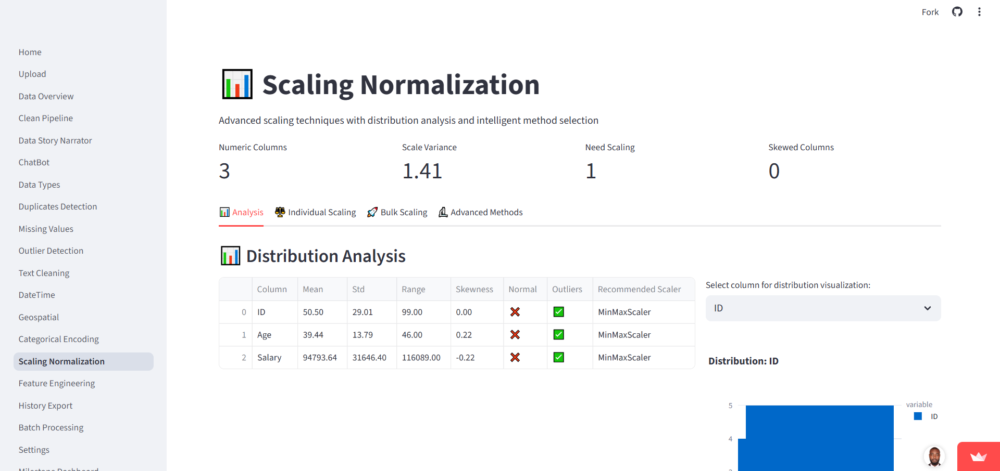  

---
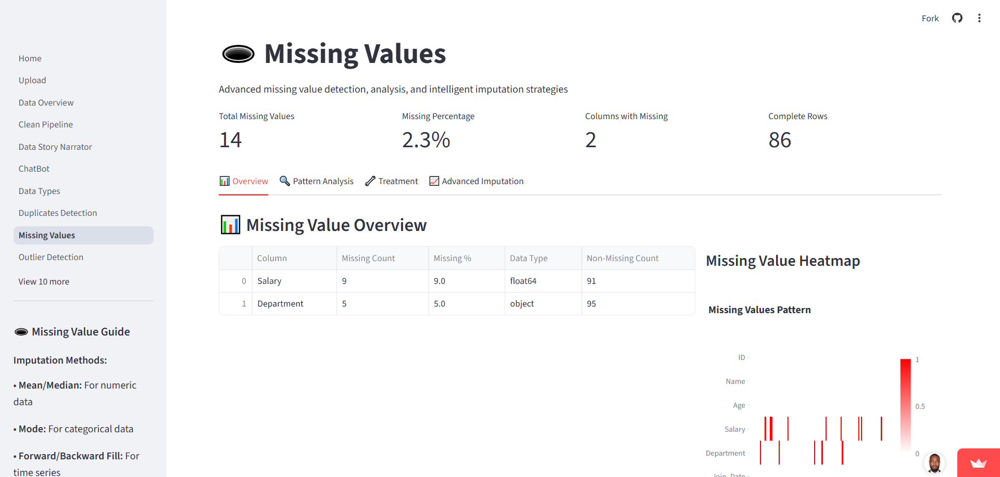

---
### 6. UI & UX Enhancements
- Multi-column selection, preview buttons, inline tips, modular layout.

---

## Technology Stack
| Component | Tools / Libraries |
|-----------|-----------------|
| Frontend | Streamlit |
| Data Processing | Pandas, NumPy |
| Machine Learning | Scikit-learn |
| Visualizations | Plotly, Seaborn |
| Text Processing | NLTK, TextBlob |
| File Handling | OpenPyXL, JSON |

---

## Quick Start Workflow

1. **Upload Data:** CSV, Excel, JSON, SQL, APIs, Cloud  
     

2. **Profile & Analyze:** Auto-detection, insights, quality assessment  
     

3. **Clean & Process:** Auto-suggestions, one-click fixes, manual overrides  
     

4. **Export & Share:** Clean datasets, pipelines, reproducible Python code  
   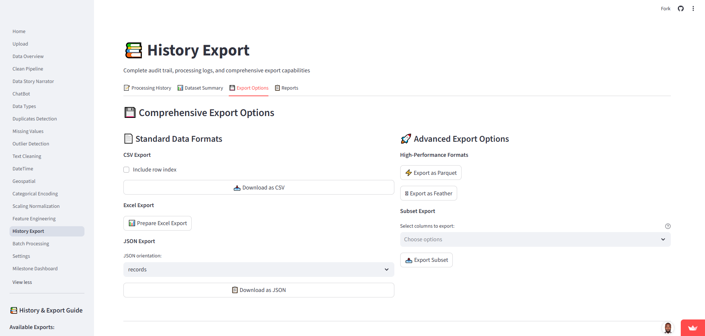

---

## Why KlinItAll Was Built
“Nearly 60–80% of time in data projects is consumed by cleaning, formatting, and fixing datasets. KlinItAll automates tedious preprocessing, allowing data scientists to focus on **insights and model building**.”  
Francis Afful Gyan, M.Sc., University of Ghana Business School  

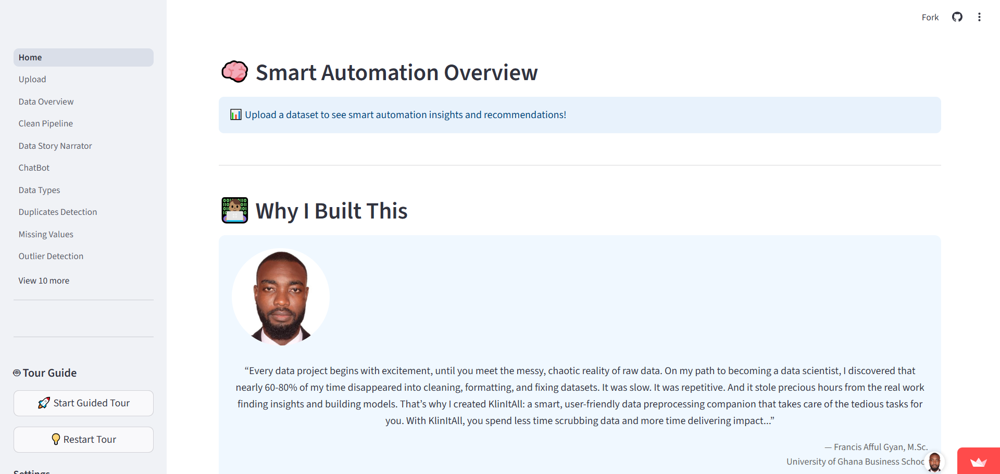

---

## Future Enhancements
### Collaboration & Multi-User Support *(Planned Feature)*
- Personalized logins for session tracking.  
- Multi-user collaborative workflows with **real-time updates**.  
- Audit logging for reproducibility and research compliance.  
- Role-based access control for secure data handling.  
- Shared project reports for collaborative research.  

---

## Data Sources & Formats
- 📂 File Upload  
- 🗄️ Database Connection  
- ☁️ Cloud Storage  
- 📋 Special Formats  
- 🔗 API & Web Data

---

## Contact
For questions, collaboration, or research inquiries:  

---

## Acknowledgements
This project was developed as part of academic research and professional practice in **data science, machine learning, and predictive analytics**. All datasets used are synthetic or anonymized.

---

**Smart Data Preprocessing System**  
*Version 1.0 | Author: Francis Afful Gyan, M.Sc.*  
**Institution:** University of Ghana Business School

